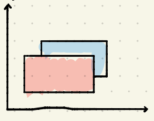

# 2014-15 Exame

## 1

### a
```
Ic = 2 * sqrt(2) / 2 + 4 * 1/2 * cos(45º) + 4 * 0 * 0 =<br>
sqrt(2) + sqrt(2) = 2 * sqrt(2)

Ib = 2 * 0 + 4 * 1/2 * 1 + 4 * 0 * sqrt(2) / 2 = <br>
2

Como 2*sqrt(2) > 2, Ic > Ib
```


### b

```
3 * sqrt(2) = 2 * sqrt(2) / 2 + 4 * 1/2 * cos(45) + K * 4 * sqrt(2) / 2 <=>
3 * sqrt(2) = sqrt(2) + sqrt(2) + 2 * sqrt(2) * K <=>
K = 1/2 
```

### c

```
3 * sqrt(2) = 2 * sqrt(2) / 2 + (4 * 1/2 * sqrt(2) / 2) / (4 sqrt(2)) + (K * 4 * sqrt(2) / 2) / 4 <=>
3 sqrt(2) = sqrt(2) + 1/4 + k sqrt(2) <=>
2 sqrt(2) - 1/4 = k sqrt(2) <=>
2 - sqrt(2) / 8 = k

Como K tem de ser > 1 é impossível.
```

## 2

**Falso** - Não é um agloritmo de projeção de sombras mas sim de cálculo de visibilidade e pode ser utilizado sem fontes de luz.

## 3

**Falso** - O método reduz o *Mach Band* quando comparado com outros métodos mas não é isento do mesmo.

## 4


Frame-buffer (Juliane)



Z-buffer 
|||||||||
|-|-|-|-|-|-|-|-|
|0|0|0|0|0|0|0|0|
|0|0|0|0|0|0|0|0|
|0|0|2|2|2|2|0|0|
|0|4|4|4|4|2|0|0|
|0|4|4|4|4|0|0|0|
|0|0|0|0|0|0|0|0|

## 5

| R | G | B | H | S | V |
|---|---|---|---|---|---|
|100|100|50 |60 |50 |100|
|100|100|75 |60 |25 |100|
|25 |50 |50 |180|50 |50 |
|25 |50 |25 |120|50 |50 |

## 6

### a
```
MT = T(5, 3) * R(-30º) * S(1/2, 1/2)
```

### b
```
MT = T(5, 3) * R(-6º) * T(-5, -3)
```

## 7

### a
```
RIP desenho
```

### b
```
Como P4 de S1 = P1 de S2 as curvas são contínuas.

(P4 - P3) = k (P5 - P4) <=> <br>
([6, 5] - [6, 1]) = k([6, 7] - [6, 5]) <=> <br>
[0, 4] = k[0, 2] <br>
k = 2

Como k > 0 && k != 1 as curvas têm continuidade **G1**.
```

## 8

16 V - 24 E + 11 F - 0 H = 2(1 C - 0 G) <=> <br>
3 = 4

RIP
## 9


